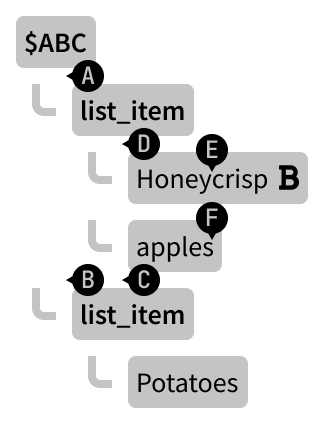

# [Saguaro](https://en.wikipedia.org/wiki/Saguaro): prickly collaboration

* Organiser: [J. Ryan Stinnett](https://matrix.to/#/@jryans:matrix.org)
* Status: Draft

## Background

Inspired by ideas in [Peritext](https://www.inkandswitch.com/peritext) and tree-focused CRDTs, we describe an intent-preserving collaboration algorithm for rich text documents modeled as some tree of nodes, such as the DOM tree from web platfom or the generic AST [proposed](/@jryans/collaborative-documents) for Matrix-native documents.

## Syntax

While Saguaro itself is an abstract set of rules for capturing intent and resolving changes, it's easier to understand by showing examples in a concrete syntax.

This document uses the [proposed change syntax](/@jryans/collaborative-documents#Changes) for Matrix-native collaborative documents:

```json
{
    "type": "m.document.change",
    "content": {
        "algorithm": "org.matrix.saguaro",
        "device_id": "EGHYCQRQXH",
        "operation": "...", // algorithm-defined string
        "position": { // algorithm-defined value
            ...
        }, 
        "content": [ // algorithm-defined value (optional)
            ...
        ], 
    }
}
```

Example change operations in this document will show only the `operation`, `position`, and `content` fields for brevity.

## Positions

Saguaro specifies positions in terms of a parent change along with a path within that change. By referencing a parent change, the position remains well-defined even when syncing concurrent changes.

The path gives one or more indices needed to traverse the content tree as well as strings at the leaves. Indexing is zero-based. Path indices identify a node among its siblings. The last path index identifies a space between nodes or characters.

For example, in some change `$ABC` with the following content:



| Position | Path | Description |
| -------- | ---- | ----------- |
| `A` | `0` | Beginning of change content |
| `B` | `1` | After the first `list_item` |
| `C` | `0, 2` | After "apples" (distinct from `B`) |
| `D` | `0, 0` | Beginning of first `list_item`'s children |
| `E` | `0, 0, 5` | After "y" in "Honeycrisp" |
| `F` | `0, 1, 6` | After "s" in "apples" (distinct from `B` & `C`) |

Some positions point to spaces between nodes, while others point to spaces between characters. This determines the valid type of the content for operations: 

* Text operations point to character positions and use strings as content
* Tree operations point to node positions and use fragments as content

As a document evolves over time, various changes events will have been composed together. This also means there are multiple ways to identify the same space in the document depending on which parent change event is used. Positions should generally be specified relative to the most recent event currently known to an editor which modified that space, but other events remain valid positions as well.

## Ordering

Many CRDT and similar algorithms use counters to establish an order of operations. 

When [building on Matrix](/@jryans/collaborative-documents#Ordering), we can rely on the platform to supply [causally ordered](https://mattweidner.com/2022/02/10/collaborative-data-design.html#causal-order) streams of operations for each participating device. Matrix does not provide a global ordering of operations across multiple devices, so each collaboration algorithm is responsible for ensuring all devices end up with the same state.

If there are multiple changes based on the same parent change, Saguaro orders them by device ID.

## Text

Text operations point to character positions and use strings as content.

### Operations

* `add`
* `remove`
* `replace`
* `move`

#### `add`

```json
{
    "operation": "add",
    "position": {
        "change_id": "$ABC",
        "path": [0, 2, 6] // After "s" in "apples"
    }, 
    "content": " (crisp)"
}
```

#### `remove`

```json
{
    "operation": "remove",
    "position": {
        "anchor": {
            "change_id": "$ABC",
            "path": [0, 0, 5] // After "y" in "Honeycrisp"
        },
        "head": {
            "change_id": "$ABC",
            "path": [0, 0, 10] // After "p" in "Honeycrisp"
        }
    }
}
```

#### `replace`

```json
{
    "operation": "replace",
    "position": {
        "anchor": {
            "change_id": "$ABC",
            "path": [0, 0, 5] // After "y" in "Honeycrisp"
        },
        "head": {
            "change_id": "$ABC",
            "path": [0, 0, 10] // After "p" in "Honeycrisp"
        }
    },
    "content": " coated"
}
```

#### `move`

```json
{
    "operation": "move",
    "position": {
        "anchor": {
            "change_id": "$ABC",
            "path": [0, 0, 5] // After "y" in "Honeycrisp"
        },
        "head": {
            "change_id": "$ABC",
            "path": [0, 0, 10] // After "p" in "Honeycrisp"
        },
        "to": {
            "change_id": "$ABC",
            "path": [0, 1, 0] // Before "a" in "apples"
        }
    }
}
```

## Trees

Tree operations point to node positions and use fragments as content.

### Operations

* `add`
* `remove`
* `replace`
* `move`
* `wrap`
* `unwrap`

#### `add`

```json
{
    "operation": "add",
    "position": {
        "change_id": "$ABC",
        "path": [0, 2] // After "apples"
    }, 
    "content": {
        "type": "text",
        "marks": [
            {
                "type": "em"
            }
        ],
        "text": "(fresh)"
    }
}
```

#### `remove`

```json
{
    "operation": "remove",
    "position": {
        "anchor": {
            "change_id": "$ABC",
            "path": [1] // After the first list_item
        },
        "head": {
            "change_id": "$ABC",
            "path": [2] // After the second list_item
        }
    }
}
```

#### `replace`

```json
{
    "operation": "replace",
    "position": {
        "anchor": {
            "change_id": "$ABC",
            "path": [0, 0] // Beginning of first `list_item`'s children
        },
        "head": {
            "change_id": "$ABC",
            "path": [0, 2] // End of first `list_item`'s children
        }
    },
    "content": {
        "type": "text",
        "text": "Apples"
    }
}
```

#### `move`

Move operations require special attention, especially in a tree environment. Concurrent moves can easily cause conflicts, detached cycles, and other kinds of state confusion ([Nair et. al](https://arxiv.org/abs/2103.04828)). To avoid these issues, Saguaro only applies the first move targeting a region and ignores all others.

The destination position (`to` field) is specified using the indices for that position before the existing content is removed.

```json
{
    "operation": "move",
    "position": {
        "anchor": {
            "change_id": "$ABC",
            "path": [0] // Beginning of change content
        },
        "head": {
            "change_id": "$ABC",
            "path": [1] // After the first `list_item`
        },
        "to": {
            "change_id": "$ABC",
            "path": [2] // After the second `list_item`
        }
    }
}
```

#### `wrap`

To better capture the intent of operations like converting several paragraphs to list items, Saguaro supports atomic wrap and unwrap operations.

The wrapping content is inserted at the anchor position. The leaf node of the wrapping content is duplicated and used as the parent of each top level sibling in the selected region.

```json
{
    "operation": "wrap",
    "position": {
        "anchor": {
            "change_id": "$ABC",
            "path": [0, 0] // Beginning of first `list_item`'s children
        },
        "head": {
            "change_id": "$ABC",
            "path": [0, 2] // End of first `list_item`'s children
        }
    },
    "content": {
        "type": "bullet_list",
        "content": [
            {
                "type": "list_item"
            }
        ]
    }
}
```

#### `unwrap`

Unwrap removes the one or more ancestor nodes from the selected region.

```json
{
    "operation": "unwrap",
    "position": {
        "anchor": {
            "change_id": "$ABC",
            "path": [0] // Beginning of change content
        },
        "head": {
            "change_id": "$ABC",
            "path": [2] // End of change content
        }
    },
    "content": {
        "type": "list_item"
    }
}
```

## Performance

* [ ] Needs performance analysis

## Related work

The ideas here are most directly influenced by [ProseMirror](https://prosemirror.net), [Peritext](https://www.inkandswitch.com/peritext), and Matthew Weidner's [CRDT design guide](https://mattweidner.com/2022/02/10/collaborative-data-design.html). Nair et al.'s [tree replication](https://arxiv.org/abs/2103.04828) was helpful in thinking about safe move operations. These and many other related resources are collected below.

### CRDTs

#### Principles

* Matthew Weidner. [Designing Data Structures for Collaborative Apps](https://mattweidner.com/2022/02/10/collaborative-data-design.html). 2022.

#### Algorithms and implementations

* Geoffrey Litt, Slim Lim, Martin Kleppmann, Peter van Hardenberg. [Peritext: A CRDT for Rich-Text Collaboration](https://www.inkandswitch.com/peritext). 2021.
* Martin Kleppmann, Alastair R. Beresford. [A Conflict-Free Replicated JSON Datatype](https://arxiv.org/abs/1608.03960). 2017.
* Martin Kleppmann, Dominic P. Mulligan, Victor B. F. Gomes, Alastair R. Beresford. [A Highly-Available Move Operation for Replicated Trees](https://ieeexplore.ieee.org/document/9563274). 2022.
* Sreeja Nair, Filipe Meirim, Mário Pereira, Carla Ferreira, Marc Shapiro. [A coordination-free, convergent, and safe replicated tree](https://arxiv.org/abs/2103.04828). 2022.

#### Granularity

* Luc André, Stéphane Martin, Gérald Oster, Claudia-Lavinia Ignat. [Supporting Adaptable Granularity of Changes for Massive-scale Collaborative Editing](https://hal.inria.fr/hal-00903813/document). 2013.

### Editors

* Marijn Haverbeke and contributors. [ProseMirror](https://prosemirror.net). 2016 -- present.
